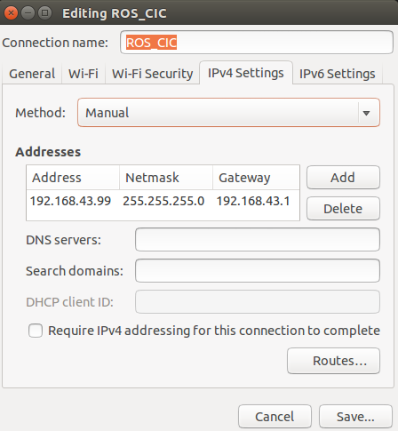
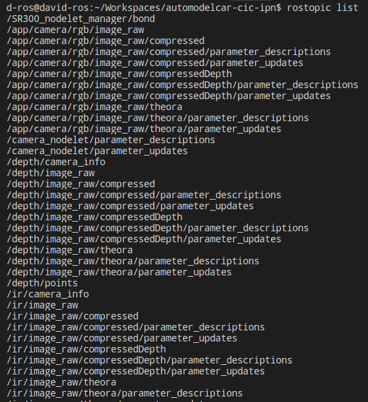

# AutoModelCar CIC IPN
Welcome to the CIC's AutoModel Car gitHub. This repository contents the code for the next modules:

- Image processing and camera adjustment (C++ and Python).
- Lane follower (C++ and Pyhton).
- Intersection detector (C++ and Pyhton).
- Obstacke detection (C++ and Pyhton).
- Joystick (C++).

The ROS distro used is Indigo along with Ubuntu 14.10 LTS. All the C++ and Pyhton Modules are included in different ROS packages. The launch files are also included.

**IMPORTANT: Before starting, make sure you have ROS and all it's deppendencies properly installed on your PC! Otherwise, visit the [ROS Tutorials](http://wiki.ros.org/ROS/Tutorials/InstallingandConfiguringROSEnvironment).**

## Establish communication with the car
Fist set the correct parameters to the Ad-hoc network. Click the wifi icon and then the "Edit Connections" option.

Select the automodel's wifi "ROS_CIC" and edit it. On "IPv4 Settings" set the next parameters as follows:

* Method: Manual
* Address: 192.168.43.99
* Netmask: 255.255.255.0
* Gateaway: 192.168.43.1

Its recommendable not to repeat the same adress on different computers. 

Once you have saved the changes, connect to its network and type the next command to ensure you have communication.

    ping 192.168.43.102

If established correctly something similar should appear in your terminal.

Now edit the bashrc file. This file dictates where to run the master, either local or on car.

    cd
    sudo gedit .bashrc

At the bottom of the file copy the next lines.

    #Run the master on the car
    export ROS_MASTER_URI=http://192.168.43.102:11311
    export ROS_HOSTNAME=192.168.43.97

    #Run the master on local
    #export ROS_MASTER_URI=http://localhost:11311
    #export ROS_HOSTNAME=localhost

Save the file and source it.

    source .bashrc

When ever you want to run on local comment the two lines below "Run the master on car" and if you want to run on the car comment the two lines below "Run the master on local"

Finally, with the connection already established type the next command.

rostopic list 

## Cloning the repository
Create a new folder named "Workspaces"

    mkdir Workspaces

Access the folder

    cd Workspaces

In order to start working with the code, first clone the repository on your /Workspace folder by typing:

    git clone https://github.com/Conilo/automodelcar-cic-ipn.git

## Build the code:
Then, it's necesarry to compile the code (also after modifiying any file or node source). To do so, type:

> bash compile.bash

To compile the code in "release mode" add the `-s` flag:

> bash compile.bash -s

## Run the code

There are different run modes available, depending on the function needed. The next subsections explain each mode functionalities and how to run them.

### Camera adjustment mode

To run the camera adjustment mode, type:

> bash start.bash -cm

A debug window will be displayed with a chessboard layout (see figure 1). To adjust the camera, you will need a printed chesboard pattern of 35x35 [cm]. Lay down the printed pattern in front of the camera and modify the parameters in the camera calibration launch file in order to match the chessboard pattern with the one displayed. Those parameters are:

- Pixel to cm ratio in the X-axis.
- Pixel to cm ratio in the Y-axis.
- Scaling factor for the X-axis.
- Scaling factor for the Y-axis.
- Four points to wrap the image in birdview.

Figure 2: Chessboard pattern displayed on camera adjustmen mode.

### Autonomous mode
This mode launches all the nodes needed to run the car on autonomous mode for the next tasks:

The launch file in charge of running the full autonomus mode is called `full.launch`,this file launches the nodes of 
* image processing, 
* lane detection, 
* crossing detection, 
* obstacle detection, and 
* master, 
Each of these nodes have their own parameters to be set in the `full.launch` file by the user, those parameters set several characteristics of performance, way of operation among other things. The most relevant parameters are mentioned here.

The first parameter and not related to a node is `debug_mode`. Setting true its value will allow to enter in debug mode, if `run_on_car` is also set true an error will occur, both parameters can't be set true simultaneously. Setting the value false, normal operation will continue. 

An other important parameter is `direct_mode` from LaneDetection node, setting true this parameter will publish directly to the motor topics, unlike false that first goes through master node. Continuing with this same node, is `max_vel`, which sets the maximum velocity of the automodel, its important to mention that the more negative it's, the faster it goes. 

Finally from master node is the `passing_allowed` parameter. When an obstacle is detected if set true the automodel will overtake it, otherwise it will wait for the obstacle to disapear.  

#### Relative parameters
This section deals with some physical parameters and some debuging:
* `debug_mode`: 
* `run_on_car`:
* `lane_width`: 
* `max_steering_angle_right`: this is        related to the physical limitations of the akerman's mechanism servo, as the name states sets the max angle posible to the right. Its set in sexagesimal degrees.
* `max_steering_angle_left`: this is        related to the physical limitations of the akerman's mechanism servo, as the name states sets the max angle posible to the left. Its set in sexagesimal degrees.

#### Parameters for Image Processing node
* `calibration_mode`
* `pixel_cm_ratio_x`
* `pixel_cm_ratio_y`
* `scale_x`
* `scale_y`
* `p1`
* `p2`
* `p3`
* `p4`

#### Lane Detection
* `direct_mode`
* `max_vel` fas
* `steering_speed_ratio`
* ``
* ``
* ``

## Run the code with bags
To run the code with bags on the PC, having a ROS master running is needed,  you can do it by typing:

> roscore

or 

> bash start.bash -mode

where "mode" is to be replaced with the desired mode. Then, to play the desired bag, type:

> bash play_bag.bash desired_bag

where the "desired_bag" is the file name without extention.

**IMPORTANT: before playing a ROS bag file, make sure that a bags/ folder with your bag inside it exists in your working space. Otherwise, you may need to modify the play_bag.bash file to adjust the path to your bags container folder.**

## Contact:
If you need more info about the code, please contact:

* Project Coordinator:
Erik Zamora Gómez (e-mail: ezamora1981@gmail.com).

* Project Manager: 
Cesar Gerardo Bravo Conejo  (e-mail: conilo@gmail.com).

Student assistants:
- Brenda Camacho Garcia (e-mail: brendacg616@gmail.com).
- Esteban Iván Rojas Hernández (e-mail: rojasesteban23@gmail.com).
